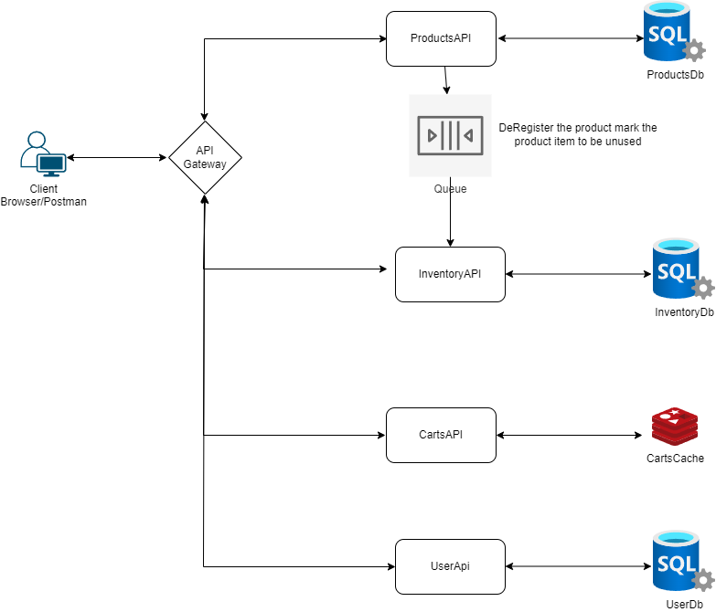

- [Laboratory Inventory Management for Reagents and Consumables](#laboratory-inventory-management-for-reagents-and-consumables)
  - [Requirement Analysis and Design](#requirement-analysis-and-design)
    - [Key Features](#key-features)
    - [Products](#products)
    - [Inventory Management](#inventory-management)
    - [Cart Management](#cart-management)
    - [UserManagement](#usermanagement)
    - [Tech Stack](#tech-stack)
    - [Challenges or opportunities for extension](#challenges-or-opportunities-for-extension)
  - [Pending items](#pending-items)
    - [docker commands](#docker-commands)
    - [Scenarios for demo](#scenarios-for-demo)
    - [Reference](#reference)

# Laboratory Inventory Management for Reagents and Consumables
## Requirement Analysis and Design

### Key Features
1. A catalog of qualified reagent and consumable products to be used in the laboratory.
2. Tracking of inventory usage through ‘Check-in’ and ‘Check-out’ of product items.
3. Provide insights into inventory usage through various reports and dashboards.
4. Track Inventory needs with a cart - cache database

### Products
  - Two categories of products, consumable and reagents, can be differentiated by `productcategory` in database
  - Each product has a unique id i.e. GTIN - Global Trade Item Number
  - Other properties include Name, Material Number, Vendor, Description, Unit Of Measure
  - Operations Performed on the product include
    - Registration of product - add product to product database.
    - DeRegister product - de register product from the product catalog, the de register should not remove the product from catalog, 
    - mark the product as active or inactive based on registration or De registration with a flag.
    - deregister should also mark the product item as checked out and no more available for usage.
  - Include a service api to support CRUD operation for products **ProductsAPI**
    - Create a product
    - Get Active Products
    - Get By Id
    - Get All - include active and inactive
    - deregister product - update product 
### Inventory Management
  - Keeps track of product items in the lab
  - product item life start when we receive it from vendor and `loads into system` i.e check-in of product item
    - can we check-in a product item whose product is already de register in the system
    - check if the product exist and then check-in the product into inventory.
  - product item can be checked out from the system with various reasons  
    - consumption
    - expiry
    - lost and not found
    - leakage
  - monitor inventory levels in the system with report and dashboard = PENDING
    - daily inventory status
    - expiring today or in next few days
    - expired
    - expired with reason

### Cart Management
  - Keep track of the product items that need to be refilled in the system soon.
  - maintains the list of product items in the cart that need to be acquired and filled into the system
  - support CRUD operation on Cart item
  - support Add, Update, Delete, Get by id, Get All, Clear All cart items, Add All to cart
  - Cart Item
    - Product Id 
    - quantity 
    - Product name
    - vendor name 
  - since the cart items are managed on need basis, a simple cache storage like redis can help to have items cached
  
### UserManagement
  - operator login and logout support 
  - support token based authentication
  - GET, Post, PUT and Delete operations of product and product item needs to be authorized with a token
  - support with simenesinternal - G0 and labmanager user G1
  - SiemensInternal(G0 user type)has privilege to add product and product items
  - LabManager(G1 user type) can manage product items
  - both has access to view products and product items
  - login with name and password
  - stored in a sql server
  - both has access to manage CART

  

### Tech Stack
 **Server**
 - Asp.NET core web api using .NET 6
 - Entity Framework Core 6
 - RabbitMq for messaging
 - Redis cache for cart storage
**Client:**
 - React
 - React Query - fetch api and server data state management - retry, reload, 
 - Zustand - Client state management
 - React Table
 - Chakra UI  - reusable component
 - Formik and Yup, React forms and validation
 - React secure storage  - store token
 - React icons

### Challenges or opportunities for extension
 - configuration - orchestration with multiple micro services - solution can use docker compose or AKS
 - availability - can be extended and uploaded to cloud services like AWS or Azure or GCP
 - also can leverage native cloud services like Azure Service bus instead of Rabbit Mq, Azure Sql Server, Azure Functions
 - e.g when the product is marked inactive we can add the product id to the queue (azure service bus) and an azure function can pickit up and handle inactive product

## Pending items
  
### docker commands

  ```docker
  docker pull redis
  docker run -d -p 6379:6379 redis
  

  // rabbitmq
  docker pull rabbitmq:3-management
  docker run -d --hostname my-rabbit --name product-rabbit-queue -p 8080:15672 -p 5672:5672 -e RABBITMQ_DEFAULT_USER=user -e RABBITMQ_DEFAULT_PASS=password rabbitmq:3-management 


  docker images
  docker ps -a
  docker inspect [containername/id]
  
  docker rm [containerid]


 docker build -t cartsapi:latest .
 docker run -d -p 127.0.0.1:7471:443 -p 127.0.0.1:7472:80 cartsapi:latest
  ```

  ### Scenarios for demo
   - architecture and requirement assumptions
   - register and logout, what is G0, G1 user privilages
   - product (CRUD)
   - inventory (CRUD) and dashboard api
   - CART list (CRUD)- redis cache
   - Rabbit MQ demo
  


  ### Reference
  - [Using Redis with ASP.NET Core, and Docker Container for Basket Microservices](https://medium.com/aspnetrun/using-redis-with-asp-net-core-and-docker-container-for-basket-microservices-715ff739186e)
  - [Connect to a Redis container hosted in Docker from a .NET Core application](https://jeremylindsayni.wordpress.com/2016/11/24/connect-to-a-redis-container-hosted-in-docker-from-a-net-core-application/)
  - [Multiple Authentication Scheme](https://medium.com/@lucas.rafael.araujo/asp-net-core-3-1-multiple-authentication-schemes-with-jwt-c860d673a71f)
  - [Adding JWT Authentication & Authorization in ASP.NET Core](https://youtu.be/mgeuh8k3I4g)
  - [Using Redis with ASP.NET Core, and Docker Container for Basket Microservices](https://medium.com/aspnetrun/using-redis-with-asp-net-core-and-docker-container-for-basket-microservices-715ff739186e)


