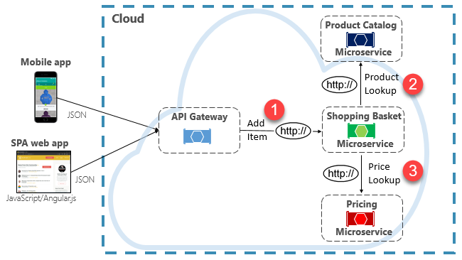
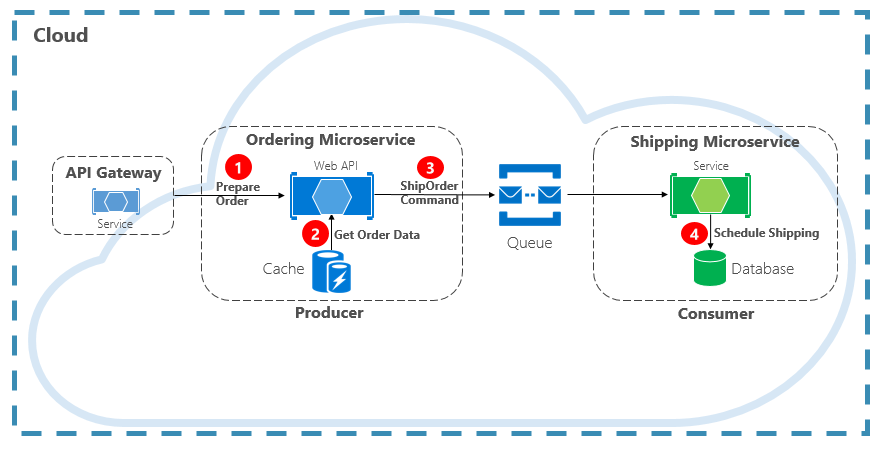
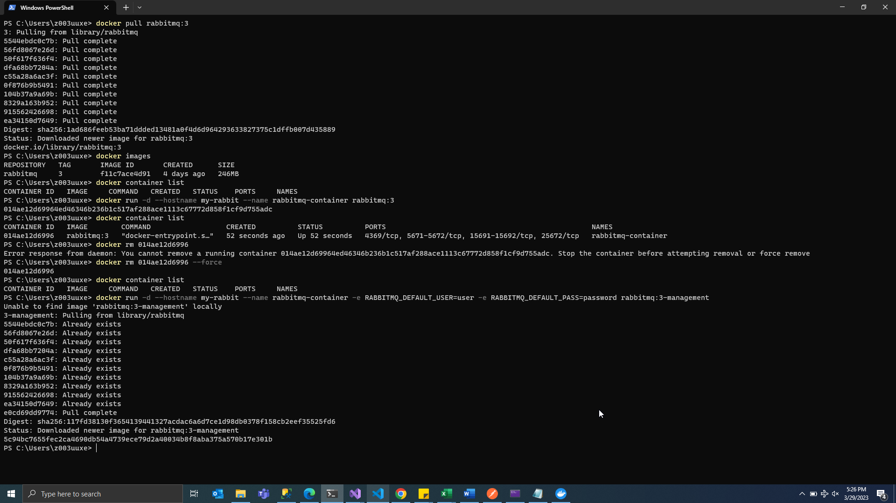
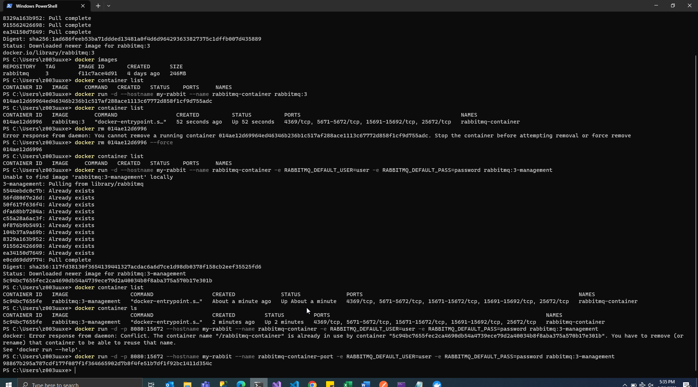

# Developing Microservices with .NET 6

- [Developing Microservices with .NET 6](#developing-microservices-with-net-6)
  - [Web Development](#web-development)
    - [WCF Vs WebAPI](#wcf-vs-webapi)
  - [Monolithic applications](#monolithic-applications)
  - [Microservices](#microservices)
    - [Benefits](#benefits)
    - [API Gateway](#api-gateway)
    - [Steps to create Microservice in .NET 6.0](#steps-to-create-microservice-in-net-60)
  - [adding migration](#adding-migration)
    - [Repository pattern](#repository-pattern)
    - [Dependency Injection](#dependency-injection)
  - [Database Design in a Microservice](#database-design-in-a-microservice)
    - [Database per service](#database-per-service)
    - [Shared Database](#shared-database)
  - [Communication between microservices](#communication-between-microservices)
    - [RabbitMQ](#rabbitmq)
  - [Docker](#docker)
    - [vm vs container](#vm-vs-container)
    - [docker images](#docker-images)
    - [Gateway](#gateway)


## Web Development

- MVC template supported by visual studio - Model View Controller
- UI in the mvc can be treated as microservice and can be deployed
  

- Use app.setting for configuration
- application handler
- http based handler
- ASP.NET web api template to create api's

### WCF Vs WebAPI
- WCF is used for developing soap based services whereas web api is used for both soap-based and restful services
- WCF doesn't not offer any for mvc feature, where web api supports mvc features
- WCF supports http, udp and custom transport protocol whereas web api supports only http protocol

## Monolithic applications
- UI, Application Logic, Data Access, database
- scaling data layer
- updating application logic require updating entire database
- not possible to have different database
- deployed to single server
- not possible to update independently
- all the services are tightly coupled.
- easier to build, debug, fewer moving parts
- tightly coupled, difficult to change


## Microservices

`Microservices` are an architectural approach to building applications where each core function, or service, is built and deployed independently. Microservice architecture is distributed and loosely coupled, so one component’s failure won’t break the whole app. Independent components work together and communicate with well-defined API contracts. Build microservice applications to meet rapidly changing business needs and bring new functionalities to market faster.

- architecture pattern for building application
- should work with other m.service to achieve the goal of the application
- can talk to other services
- has a isolated process, with memory and processing capabilities with it, for e.g. docker container
- has independent database.
- complex and Robust, technology agnostic - doe-snt matter what tech stack is used by client
- cloud native with containerization.
- microservices are api's at the end of the day! - hosted on the web. 
- docker - orchestrators to run the microservice - take care of the container complexity

### Benefits
- own database 
- can be independently developed and updated and deployed.
- can be in different technology. (java, c# or python etc.)
- broken into small tiny independent services i.e. api's
- client can be anything mobile, desktop or web.
- communicate to each other using some inter microservice communication - share data b/w microservices not database.
- evolve independently
- scale independently
- development cycle become faster - release to market
- isolated and more tolerant of failure
- single service that fails will not bring down the entire application
- testing become more coherent and consistent
- can be accessed using single api gateway.
- 70% of the application code is in api's
- front end with Angular or React - technology agnostic
  
  

1. [Microservice Architecture Reference](https://learn.microsoft.com/en-us/azure/architecture/microservices/)
1. [Microservices on Azure](https://azure.microsoft.com/en-us/solutions/microservice-applications/#solution-architectures)

### API Gateway
- authenticate users at gateway level
- routing api calls to microservices
- caching support - with time to leave capability
- change request and response type
- keep track of api's being called
- monetize the calls


### Steps to create Microservice in .NET 6.0
- Create a blank solution
- Create webapi 

  ```cs
  dotnet new webapi -n CustomerAPI
  ```

  or Add ASP.NET Core web API project
   - VehicleAPI
   - CustomerAPI
   - ReservationAPI
 - Include entity framework nuget packages for each project
   - Microsoft.EntityFrameworkCore - core
   - Microsoft.EntityFrameworkCore.SqlServer - sql server connection
   - Microsoft.EntityFrameworkCore.Tools - sql database migration
   - use EF in-memory database for testing [Ef Core With InMemory Database](https://www.infoworld.com/article/3672154/how-to-use-ef-core-as-an-in-memory-database-in-asp-net-core-6.html)


- SQL Database Connection String
  
  ```cs
  Server =(localdb)\MSSQLLocalDB;database=vehiclesdb;
  optionsBuilder.UseSqlServer(@"Server=(localdb)\MSSQLLocalDB;database=vehiclesdb;");
  ```
 ## adding migration
Run it in the package manager console, select your project `VehicleAPI` and run the below command.
 ```cs
 add-migration initialcreate
 update-database
 ```

 added new column to vehicle model and updated database with below command

 ```cs
 add-migration includedheightcolumnforvehicle
 update-database
 ```

### Repository pattern
- code is cleaner, easier to reuse and maintain
- loosely coupled system 
- talk to your database sql server or in memory
- easy to replace with a fake implementation for testing
- e.g [IVehicle](CarDrivenApp/VehicleAPI/Interface/IVehicle.cs)

### Dependency Injection
 - AddSingleton - returns same object for each caller
 - AddScoped - return new object for each run
 - AddTransient 

`Transient` objects are always different; a new instance is provided to every controller and every service.
`Scoped` objects are the same within a request, but different across different requests.
`Singleton` objects are the same for every object and every request.


Program.cs
```cs
builder.Services.AddScoped<IService, ServiceA>();
builder.Services.AddScoped<IService, ServiceB>();
```
HomeController.cs
```cs
public HomeController(IEnumerable<IService> services)
{
    this._services = services;
}

[HttpGet]
public string Get()
{
    // use reflection to resolve the service required at run time. 
    // ServiceA can be read from the configuration.
    var service = _services.First(s => s.GetType().Name == "ServiceA");
    var message = service.SayHello();
    return message;
}
```

- dont generate id for reference entity

```cs

    [Key]
       [DatabaseGenerated(DatabaseGeneratedOption.None)]
       public int Id { get; set; }

``` 


## Database Design in a Microservice

### Database per service
- `Recommended approach` by trainer.
- change to a individual database doesn't impact the other
- individual data store are easier to scale
- use can use `ployglot persistance`. sql server, mongodb, cosmosdb etc. different database technologies for different microservice
- use circuit breaker, request pattern to ensure transaction.
- use kubernetes services to orchestrate container or microservices
- 0 down time with high availability and disaster recovery


### Shared Database
- you can use shared database as well. all microservice same database. 
- transaction management - no need to span the transaction over the services.
- complicated queries with joins
- no need to exchange stored data between microservices. api is simplified and there is no problem with consistency data and state in case the communication fails.
- cost benefit
  
## Communication between microservices
- Microservice based application run distributed system on multiple processes or service
- must interact using inter process communication using protocols such as HTTP, AMQP or binary protocol TCP
- Synchronous - HTTP request/response messaging
- Asynchronous - `Recommended` and extensive used.
  - point-to-point messaging pattern with medium
  - event driven messaging pattern pub-sub
- gRPC based on RPC 

HTTP



QUEUE


- Queue: Azure Service Bus, Topic, Storage Queue, `RabbitMQ` (used in on promise)


### RabbitMQ 
- message service broker


## Docker
 - an essentially a container management platform
 - simplify the process of developing, running, managing, and distributing application by introducing the concept of container
 - container standardize executable component that package application code and dependencies allowing them to run it isolated from other processes int he host operating system
 - create, start, monitor, stop, scale container
 - we treat them as process
 - not dependent on anything outside of the container.
 - application + dependency(including os - user kernel) = container package
 - isolated from other container running on same OS.
 - container have their own network and network port.
 - `Kubernetes` is a tool for docker orchestration - can run on on premise and cloud. create, scale, update, etc for containers.


  
### vm vs container
- vm virtualize the hardware emulating a physical computer
- hypervisor, the software component that virtualize the hardware and create/runs virtual machines, allows the host machine to support multiple vms by virtually sharing the resources such as memory and processing power
- heavy packages 
- container on other do not emulate hardware, in fact they dont have an os themselves.  , sandboxes process ruins on host os isolated from other process in the operating system
- light weight, portable , easy to distribute

### docker images
 - blue prints for containers
 - containers are running instances fo an image
 - images are read only template that are used to build container
 - contain all instruction to build a docker container and include collection of files that include application code, dependencies that is required to run the application
 - Deamon: background service running on host to manage containers

Sample webapi hosted in docker
_MSSQLLocalDB.customerdb%20(AD005_z003uuxe%20(53))%20-%20Micros.png)


```cs
docker pull rabbitmq
```

Run the image as container

```
docker run -d --hostname my-rabbit --name rabbitmq-container rabbitmq:3

docker run -d --hostname my-rabbit --name rabbitmq-container -e RABBITMQ_DEFAULT_USER=user -e RABBITMQ_DEFAULT_PASS=password rabbitmq:3-management

docker run -d -p 8080:15672 --hostname my-rabbit --name rabbitmq-container-port -e RABBITMQ_DEFAULT_USER=user -e RABBITMQ_DEFAULT_PASS=password rabbitmq:3-management

docker run -it --rm --name rabbitmq-container -p 5672:5672 -p 15672:15762 rabbitmq:3-management 

```

use port `-p 8080:15672` to map the port 8080 to rabbitmq port 15672.







-Install nuget package `RabbitMQ.Client` & `Newtonsoft.Json`


### Gateway
- api gateway is an api management tool that sits between a client and a collection of backend services.
- Benefits
  - Rate Limit
  - Load Balancing
-  