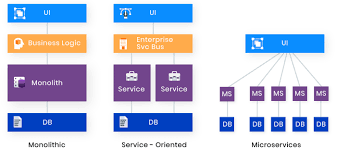
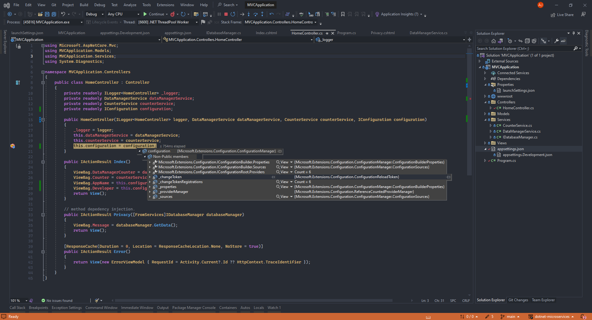
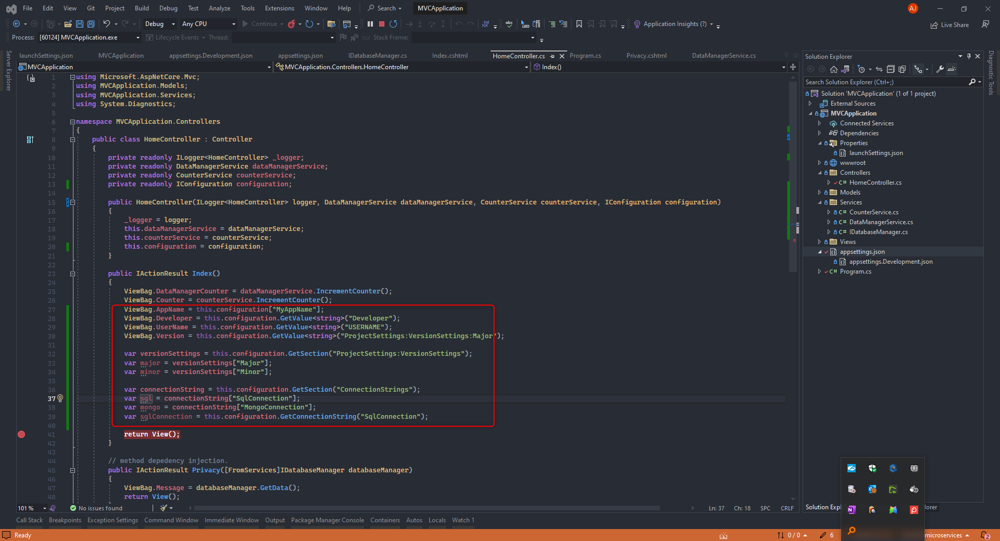
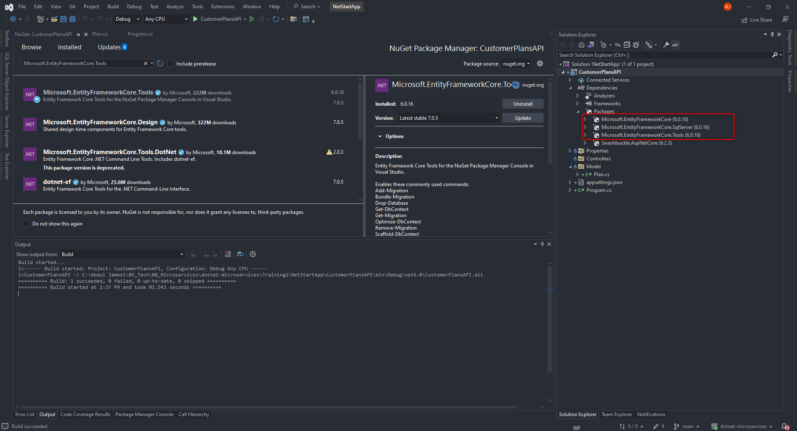

- [Monolithic](#monolithic)
- [SOA](#soa)
- [Microservices](#microservices)
    - [Messages](#messages)
    - [.NET 6.0.](#net-60)
    - [NetStar](#netstar)
    - [WebApi](#webapi)

# Monolithic
**Disadvantages/Challenges**
- size of the application can also affect the deployment 
- cannot scale independently
- cannot be technology agnostic
- fixing and deployment need to be done all at one
- independent module cannot scale 
- cannot store structured and unstructured data
- unstructured - each product can have its own data structure phone, washing machine etc.
- polyglot persistance is difficult, support for different type of storage is difficult
- adding support to `containerization` is difficult / not suitable
- used before 2000

# SOA
- WCF for SOA
- 2000 to 2010 - SOA
- functional module as independent services
- individual services like basket module, product module,
- communicate each other with ESB - Enterprise Service Bus including presentation layer
- use one or more database but they are shared
- can add or scale module independently
- can fix and redeploy if we have any issue with any module . e.g. payment module
- can use different language for different module.

# Microservices

Simplified version of SOA

A method of developing software systems
that tries to focus on building single function
modules with well defined interfaces and
operations.

Each service has its own database.

Services communicates each other using a
well defined communication
protocol/channel.

Better support for integrating with cloud
services

Uses API Gateway(Optional) to connect to individual service

Each service can talk to each other

Every module is deployed as independently service

Application size is smaller

cross communication between database is not required

Easy to deploy test, developed and can use any language

can use different database - polyglot persistance 

very complex in-terms of communication between service




### Messages
- HTTP Based 
  -  Request/Response Pattern 
  -  sync by default
  -  one to one communication
  -  always response is expected
  -  near real time communication
- Message Based
   - fallows publish/subscribe pattern
   - Queue is a message broker services - store and forward service
   - asynchronous
   - one to many pattern
   - Queue - one to one
   - Topic - one to many - e.g WhatsAppGroup
   - no guarantee for real time processing of the request
   - not a real time communication
- Event Driven
   - for real time communication like OTP generation that needs to be done - time limit
   - event publisher and subscriber
   - use EventBroker - e.g. EventGrid or Event Hub
   - not using the store and forward mechanism
   - async and no response
   - near real time
   - support one to many

| HTTP | Message | Event Driven|
|------|---------|-------------|
|sync  | async    | async      |
|1-1  | 1-many    | 1-many      |
|near realtime  | not realtime    | near realtime      |
|request-response  | pub-sub    | pub-sub      |
|storage  | store and forward    | no storage      |

### .NET 6.0.
 - cross platform version - linux, windows, Mac
 - Lightweight
 - cloud first approach
 - support cli based development (dotnet command)
   - dotnet new `ProjectType` [Options] -n [Name]
   - dotnet build
   - dotnet restore
   - dotnet run
   - dotnet add package
   - support running .dll as well for console app

```cs
add package Microsoft.EntityFrameworkCore --version 6.0.16
```

**Middleware** - perform before and after action even before the request reaches to controllers action method.
  - Map
  - UseMiddleware
  - Use[Name]
  - Map
  
**Service and Dependency Injection(DI)**
  - DI is an application of IoC - (inversion of controls)
  - inverse - framework will create object and give it to required class where it is used.
  - object is created by the container
  - legacy .net framework support DI with third party lib like autofac, unity or Ninject etc
  - in .NET Core / .NET 6 DI is inbuilt
  - constructor injection
  - method injection - injecting the object in specific method
  - property injection - get & set property - not supported by .NET Core
  - DI support decouple the classes/services - reduce dependency as a service - decoupling - 
  - .NET Core container is represented as `service collection`
  - scope and lifetime option of the dependency
    - Singleton  - same object for caller for every scope
    - Scope - one request is considered as one scope, request from user A - creates object 
    - Transient - limited scope - short lived object - always create a new and fresh object - for every request
    - e.g A/B - main - dmsservice - counterservice (c=0, c++)
    - do not use singleton for user specific data - use singleton for stateless object - e.g. dbservice, logger service
    - use transient for light weight service, e.g. calculator service
    - autofac support more scopes
    - scopes supported by .NET core can satisfy 99% of requirement
    - autofac support property injection as well
  

- **Configuration Providers**
  - legacy .NET uses App.Config & Web.Config for configuration
  - not suitable for cloud env or docker environment
  - .NET core is a cloud first approach to support CI/CD, cloud and docker based development.
  - command line args
  - system environment variables
  - key per file
  - json configuration 
  - ILI, XML, In Memory provider
  - cloud based - key vault or app configuration
  - default command line and environment variables
  - appsettings.json & appsettings.development.json
  - **ASPNETCORE_ENVIRONMENT** variable in launchsetting.json decides the environment
  
    
    

- Hosting Options

### NetStar
- Customer Plans Management
- Movies Management
- User Management
  - register with email and gets a confirmation
  - on register send a message to queue
- Email Sender - serverless service azure function or aws lambda used for background job
  
### WebApi
   
- Microsoft.EntityFrameworkCore.InMemory
-  in memory recommended for test and development purpose only

Codes
 - 200 - ok - return something with body data
 - 201 - created - post created - might contain body - newly created record with id
 - 204 - no content - delete is fine

4XX - client mistake
 - 404 - not found - record or resource is not found.
 - 400 - bad request - request is not valid.
 - 401 - unauthorized - not logged in
 - 403 - access denied - trying to access unauthorized data.

5XX - server error
 - 500 - internal server error
 