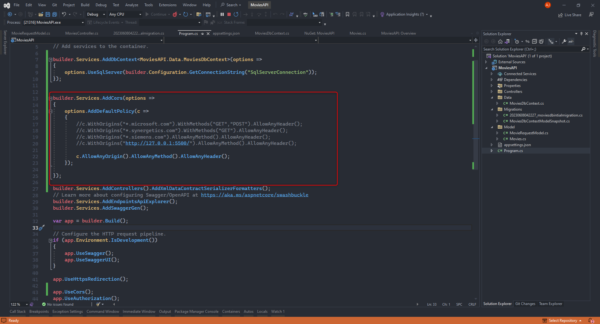

- [Monolithic](#monolithic)
- [SOA](#soa)
- [Microservices](#microservices)
    - [Messages](#messages)
    - [.NET 6.0.](#net-60)
    - [NetStar](#netstar)
    - [WebApi](#webapi)
    - [OpenID, OAuth](#openid-oauth)
    - [API Gateway](#api-gateway)
  - [Docker](#docker)
    - [Virtualization](#virtualization)
    - [Containerization](#containerization)
  - [|Container|](#container)
    - [Docker File](#docker-file)
    - [Docker Testing on CustomerPlans API](#docker-testing-on-customerplans-api)

# Monolithic
**Disadvantages/Challenges**
- size of the application can also affect the deployment 
- cannot scale independently
- cannot be technology agnostic
- fixing and deployment need to be done all at one
- independent module cannot scale 
- cannot store structured and unstructured data
- unstructured - each product can have its own data structure phone, washing machine etc.
- polyglot persistance is difficult, support for different type of storage is difficult
- adding support to `containerization` is difficult / not suitable
- used before 2000

# SOA
- WCF for SOA
- 2000 to 2010 - SOA
- functional module as independent services
- individual services like basket module, product module,
- communicate each other with ESB - Enterprise Service Bus including presentation layer
- use one or more database but they are shared
- can add or scale module independently
- can fix and redeploy if we have any issue with any module . e.g. payment module
- can use different language for different module.

# Microservices

Simplified version of SOA

A method of developing software systems
that tries to focus on building single function
modules with well defined interfaces and
operations.

Each service has its own database.

Services communicates each other using a
well defined communication
protocol/channel.

Better support for integrating with cloud
services

Uses API Gateway(Optional) to connect to individual service

Each service can talk to each other

Every module is deployed as independently service

Application size is smaller

cross communication between database is not required

Easy to deploy test, developed and can use any language

can use different database - polyglot persistance 

very complex in-terms of communication between service


### Messages
- HTTP Based 
  -  Request/Response Pattern 
  -  sync by default
  -  one to one communication
  -  always response is expected
  -  near real time communication
- Message Based
   - fallows publish/subscribe pattern
   - Queue is a message broker services - store and forward service
   - asynchronous
   - one to many pattern
   - Queue - one to one
   - Topic - one to many - e.g WhatsAppGroup
   - no guarantee for real time processing of the request
   - not a real time communication
- Event Driven
   - for real time communication like OTP generation that needs to be done - time limit
   - event publisher and subscriber
   - use EventBroker - e.g. EventGrid or Event Hub
   - not using the store and forward mechanism
   - async and no response
   - near real time
   - support one to many

| HTTP | Message | Event Driven|
|------|---------|-------------|
|sync  | async    | async      |
|1-1  | 1-many    | 1-many      |
|near realtime  | not realtime    | near realtime      |
|request-response  | pub-sub    | pub-sub      |
|storage  | store and forward    | no storage      |

### .NET 6.0.
 - cross platform version - linux, windows, Mac
 - Lightweight
 - cloud first approach
 - support cli based development (dotnet command)
   - dotnet new `ProjectType` [Options] -n [Name]
   - dotnet build
   - dotnet restore
   - dotnet run
   - dotnet add package
   - support running .dll as well for console app

```cs
add package Microsoft.EntityFrameworkCore --version 6.0.16
```

**Middleware** - perform before and after action even before the request reaches to controllers action method.
  - Map
  - UseMiddleware
  - Use[Name]
  - Map
  
**Service and Dependency Injection(DI)**
  - DI is an application of IoC - (inversion of controls)
  - inverse - framework will create object and give it to required class where it is used.
  - object is created by the container
  - legacy .net framework support DI with third party lib like autofac, unity or Ninject etc
  - in .NET Core / .NET 6 DI is inbuilt
  - constructor injection
  - method injection - injecting the object in specific method
  - property injection - get & set property - not supported by .NET Core
  - DI support decouple the classes/services - reduce dependency as a service - decoupling - 
  - .NET Core container is represented as `service collection`
  - scope and lifetime option of the dependency
    - Singleton  - same object for caller for every scope
    - Scope - one request is considered as one scope, request from user A - creates object 
    - Transient - limited scope - short lived object - always create a new and fresh object - for every request
    - e.g A/B - main - dmsservice - counterservice (c=0, c++)
    - do not use singleton for user specific data - use singleton for stateless object - e.g. dbservice, logger service
    - use transient for light weight service, e.g. calculator service
    - autofac support more scopes
    - scopes supported by .NET core can satisfy 99% of requirement
    - autofac support property injection as well
  

- **Configuration Providers**
  - legacy .NET uses App.Config & Web.Config for configuration
  - not suitable for cloud env or docker environment
  - .NET core is a cloud first approach to support CI/CD, cloud and docker based development.
  - command line args
  - system environment variables
  - key per file
  - json configuration 
  - ILI, XML, In Memory provider
  - cloud based - key vault or app configuration
  - default command line and environment variables
  - appsettings.json & appsettings.development.json
  - **ASPNETCORE_ENVIRONMENT** variable in launchsetting.json decides the environment
  
    
    

- Hosting Options

### NetStar
- Customer Plans Management
- Movies Management
- User Management
  - register with email and gets a confirmation
  - on register send a message to queue
- Email Sender - serverless service azure function or aws lambda used for background job
  
### WebApi
   
- Microsoft.EntityFrameworkCore.InMemory
-  in memory recommended for test and development purpose only

Codes
 - 200 - ok - return something with body data
 - 201 - created - post created - might contain body - newly created record with id
 - 204 - no content - delete is fine

4XX - client mistake
 - 404 - not found - record or resource is not found.
 - 400 - bad request - request is not valid.
 - 401 - unauthorized - not logged in
 - 403 - access denied - trying to access unauthorized data.

5XX - server error
 - 500 - internal server error

Cors
  - configure each service with CORS
   
   

### OpenID, OAuth 
 
 - "[Header].[Payload].[Signature]"
- https://www.jwt.io

### API Gateway
**Features:**
 - single point of contact - client can use the gateway 
 - cache
 - throttling and rate limit
 - Mocking of api requests
 - authentication
 - available as cloud service in Azure, aws etc.
 - `Ocelot` lib for creating .net api gateway's

## Docker
- Containerization tool -> prepare app/db for deployment
- Version incompatibility during deployment - framework version, nuget, npm version
- Include the dependencies during the deployment
- Dependencies include framework,nuget or npm package including operation system
- `Containerization` is a process of bundling the application along with its dependencies so that entire package can be deployed together
  
### Virtualization
- can support isolated environment for each app
- virtual machine need full resource - it include os as well
- need around 15 GB for os only
- these allocated resources may not be used by your application
- to run my application in isolated mode
- over use or under use of application can happen
- consume lot of resources - not need for the app
- lot of time is require to setup including os, dependencies and application
- not portable
- virtual machine can be of any OS - windows os can have linux os

### Containerization
- instead of new virtual machine, containerize only application and its dependencies and run it as normal process- in an isolated environment
- container = app + dependencies + os 
- container can be created by developer - package is done by developer with no hardware resources allocated = like a compressed package
- needs a container engine to run the container.
- **Docker** Engine is the underlying technology that runs containers
- one of the popular container engines is `Docker`. other include LSd, ContainerD etc.
- os can use docker to run the container.
- container are like application instances, can start, stop and run independently and take less time to start and stop
- Agent OS - not a full OS- in container - its just a kernel + shell
- kernel = interactive server engine
- we don't allocate fixed memory or ram or cpu
- memory allocation is done by host os
- app communicate to agent os and then forwarded to host os. agent os just acts as agent (forward request to host os)
- agent os - max of 150 MB
- sdk = runtime + compiler + debugger + profiler (DevTools)
- runtime = only runtime used for production environment - some around 120 mb
- container contain compiled application 
- size to too less, less than 500 mb 
- isolated environment and more light weight
- can be ported to other setup and machines
- disadvantages
  - resource request is handled by os agent - allocation is still handled by os agent
  - you cannot run linux container on windows machine or vice-versa
  - agent os is linux cannot talk to windows host os
  - developing linux container on windows machine with a WSL
  - to deploy on linux server, local dev should be done and create a image with linux os agent and deploy it to server
  
|Container|
---------------
| application |
| Framework   |
| Runtime     |
| Os Agent    |

WSL Commands
```powershell
wsl --update
wsl -l -v
wsl --install -d Ubuntu
```
- container registry is a cloud service - push your container to upload this images to container registry(known as docker) using `docker push` command
- docker hub is a public container registry
- server does the `docker pull` to download 
- private container repository Azure Container Registry - ACR , ESR (aws), GCR(google)
- Image - blue print or templated = physical file - can run the image with `docker run..` command
  - ID
  - Name => helloapp:1.0 (name:tag), default tag is `latest`, name cannot be duplicated
- container - executable - the running instance , start and stop and restart - like a process
  - ID
  - Name
- database/redis cache can also run as container
- `docker build` to create the image
-  `docker run id/name` to start container
- `docker stop id/name` to stop the docker
- `docker start id/name` restart the container
- `docker rm id/name` to remove the container
- `docker rmi id/name` to remove image
- `docker push` - push to registry
- `docker pull` - pull from registry
- docker has its own network known as bridge network
- do port mapping to map from your machine to this container bridge network
- `docker images`

```powershell
docker run images
docker pull sonusatjya/sample:latest
docker run --name sonuapp -p 8050:80 --rm -d sonusathyadas/sampleapp:latest
//rm is for removed
docker ps //list of running the container
docker ps -a
```

### Docker File
 - instruction for building image
  - create docker file and run `docker build`
```docker
FROM <baseImage> [as StageName]
RUN <cmd>[args] // command run at the time of building the image
e.g. RUN dotnet restore && dotnet build && dotnet publish
LABEL Key value //metadata for image
ENV key value // environment variable
EXPOSE Port
CMD ["CMD","arg1","arg2"] // executes when the container starts.
ENTRYPOINT ["cmd","arg1"]
COPY from to  //your machine to image
```

```powershell
docker build -t sampleapp .
```

```docker
FROM mcr.microsoft.com/dotnet/sdk:6.0 AS build-env
WORKDIR /app
COPY *.csproj ./
RUN dotnet restore
COPY ./ ./
RUN dotnet publish -c Release -o out

# Build runtime image
FROM mcr.microsoft.com/dotnet/aspnet:6.0
WORKDIR /app
EXPOSE 80
EXPOSE 443
COPY --from=build-env /app/out .
ENTRYPOINT ["dotnet", "TodoAPI-NET6.dll"]


docker run -e "ACCEPT_EULA=Y" -e "MSSQL_SA_PASSWORD=Password@123" -p 1433:1433 -d mcr.microsoft.com/mssql/server:2022-latest
```

### Docker Testing on CustomerPlans API

```docker
// sql server image download and run locally
docker run -d -p 1433:1433 mcr.microsoft.com/mssql/server:2022-latest

// check sql server ip and copy it in api docker environment variables
docker inspect 

// build api docker
docker build -t customerplansapi:latest .

// run api container
docker run -p 8052:80 -d customerplansapi:latest

  docker run -d -p 127.0.0.1:7471:443 -p 127.0.0.1:7472:80 customerplans:1.0.0.0
```


